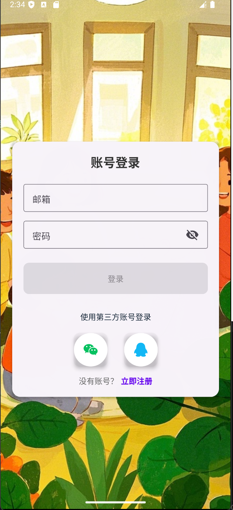

# 勤云小筑家务管理应用

一款基于React Native开发的家庭家务管理应用，帮助家庭成员更高效地分配、管理和完成家务任务，提高家庭生活质量。

## 功能特点

- **家庭成员管理** - 创建家庭并添加成员
- **智能任务分配** - 根据成员特性和偏好分配家务
- **语音助手** - 支持语音识别和语音合成
- **任务追踪** - 跟踪家务完成情况
- **积分奖励系统** - 完成任务获取积分
- **社区分享** - 分享经验和家务技巧
- **个人成就** - 记录个人家务成就
- **家庭排行榜** - 查看家庭成员贡献排名

## 技术栈

- **React Native 0.78.0** - 跨平台移动应用开发框架
- **React Navigation 7** - 界面导航
- **React Native Paper** - UI组件库
- **Redux/Redux Toolkit** - 状态管理
- **阿里云语音服务** - 提供语音合成(TTS)
- **百度语音服务** - 提供语音识别(ASR)
- **MongoDB** - 后端数据库
- **Express** - 后端框架

## 📱 应用界面

| 登录页面 | 主页 | 任务详情 |
|  |  |  |

## 安装和使用

### 前置条件

- Node.js (v18+)
- React Native CLI
- Android Studio (Android开发) 或 Xcode (iOS开发)

### 安装步骤

1. 克隆仓库
```bash
git clone https://github.com/jiashi-feng/software.git
```
oiojp
2. 安装依赖
```bash
yarn install
```

3. 启动Metro服务器
```bash
yarn start
```

4. 运行应用
```bash
# Android
yarn android

# iOS
yarn ios
```

### 后端服务

该应用使用自定义后端服务处理数据和提供API：

```bash
# 启动后端服务
yarn backend

# 开发模式启动后端
yarn dev-backend
```

## 项目结构

```
family-task-manager/
├── src/                      # 前端代码
│   ├── assets/               # 静态资源（图片、字体等）
│   ├── components/           # 可复用组件
│   ├── navigation/           # 导航配置
│   ├── screens/              # 主要页面
│   ├── services/             # API服务和工具
│   ├── store/                # Redux状态管理
│   └── App.jsx               # 应用入口
│
├── server/                   # 后端代码
│   ├── task-service/         # 任务管理后端
│   ├── voice-service/        # 语音服务后端
│   └── index.js              # 后端入口
│
└── android/                  # Android平台特定代码
└── ios/                      # iOS平台特定代码
```

## 功能模块

- **登录与注册** - 用户账户管理
- **家庭管理** - 创建和管理家庭成员
- **任务创建与分配** - 新建并分配家务任务
- **任务跟踪** - 查看和更新任务状态
- **成就与奖励** - 记录完成情况和积分奖励
- **语音交互** - 语音指令和语音反馈
- **社区交流** - 分享经验和互动

## 贡献

欢迎提交问题和改进建议。如需贡献代码，请遵循以下步骤：

1. Fork项目
2. 创建特性分支 (`git checkout -b feature/your-feature`)
3. 提交更改 (`git commit -m 'Add some feature'`)
4. 推送到分支 (`git push origin feature/your-feature`)
5. 创建Pull Request

## 许可证

MIT
